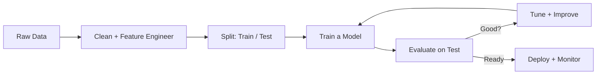

# 🤖 Machine Learning Mastery (Deep) — PJ's Academy

**From "what is a model?" to building, evaluating, and deploying real ML systems — explained so a complete beginner truly understands, not just copies code.**

Most ML courses either drown you in math or hand you `model.fit()` with no understanding. This one builds **intuition first**, then math, then code, then a real project — every single topic.

> Prerequisite: basic Python (variables, loops, functions) and basic SQL helps. We teach the ML from zero. Math is explained in plain English before any formula.

---

## 🎯 Who This Is For
- Beginners who want to *understand* ML, not just run notebooks
- Analysts/developers moving into data science
- Anyone prepping for ML interviews or building AI products

## 📚 Course Structure — 10 Modules

| Module | Topic | You'll Master |
|--------|-------|---------------|
| [01](module-01-what-is-ml.md) | What ML Really Is | Types, the ML workflow, key mental models |
| [02](module-02-data-prep.md) | Data & Features | Cleaning, encoding, scaling, feature engineering |
| [03](module-03-regression.md) | Regression | Linear, polynomial, regularization — predicting numbers |
| [04](module-04-classification.md) | Classification | Logistic, kNN, Naive Bayes, decision trees |
| [05](module-05-ensembles.md) | Ensembles | Random Forest, Gradient Boosting, XGBoost |
| [06](module-06-evaluation.md) | Evaluation | Metrics, cross-validation, bias-variance, overfitting |
| [07](module-07-unsupervised.md) | Unsupervised | Clustering (K-Means), PCA, dimensionality reduction |
| [08](module-08-tuning.md) | Tuning & Selection | Feature selection, hyperparameter tuning, pipelines |
| [09](module-09-neural-nets.md) | Neural Networks | The intuition + a first network from scratch & Keras |
| [10](module-10-production.md) | ML in Production | Deployment, monitoring, drift, real-world pitfalls |

Plus: **[15 hands-on projects](projects.md)** and a **[practice/quiz bank](practice.md)**.

---

## 🧠 The Big Picture (the mental model for the whole course)



Every module fits somewhere in this loop. Keep coming back to this picture.

---

## 🧰 Tools You'll Use
`Python` · `NumPy` · `Pandas` · `scikit-learn` · `Matplotlib` · `XGBoost` · `Keras/TensorFlow` (Module 9)

```bash
pip install numpy pandas scikit-learn matplotlib seaborn xgboost tensorflow
```

## 💡 How To Learn This
1. Read the **intuition** section — don't skip to code.
2. Run every code example and change the numbers to see what happens.
3. Do the module exercises.
4. Build the module's project before moving on.

## 🏆 Outcome
You'll be able to frame a problem as ML, prepare data, choose and train the right model, evaluate it honestly, tune it, and deploy it — with a portfolio of 15 projects to prove it.

---

*Course: 🤖 Machine Learning Mastery — [PJ's Academy](https://pjsacademy.com) · hello@pjsacademy.com*
