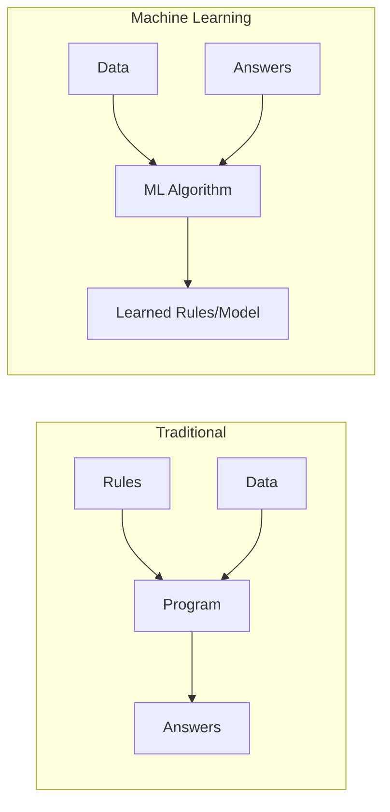
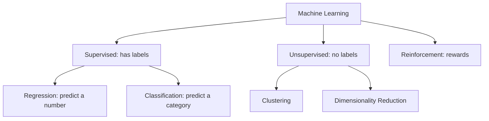
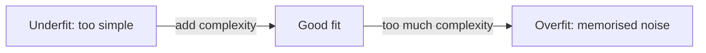

# Module 01 — What Machine Learning Really Is

> Before a single line of code: the mental models that make everything else click.

---

## 1.1 The One-Sentence Definition

**Machine Learning is teaching a computer to find patterns in data so it can make predictions on new data it hasn't seen.**

Traditional programming: you write the **rules**, the computer applies them.
Machine learning: you give the computer **examples**, and it figures out the rules itself.



**Example:** To detect spam the old way, you'd write "if email contains 'lottery' → spam." That breaks instantly. ML instead learns from thousands of labelled emails what spam *looks like*, including patterns you'd never think to write.

## 1.2 The Three Types of ML

### Supervised Learning (most of this course)
You have **labelled data** — examples with the "right answer." The model learns the mapping from input → output.
- **Regression** — predict a **number** (house price, temperature, sales).
- **Classification** — predict a **category** (spam/not-spam, disease/healthy, which digit).

### Unsupervised Learning
No labels — the model finds **structure** on its own.
- **Clustering** — group similar things (customer segments).
- **Dimensionality reduction** — compress features (PCA).

### Reinforcement Learning
An agent learns by **trial and error** with rewards (game AI, robotics). Not our focus here.



## 1.3 Core Vocabulary (learn these once, use them forever)

| Term | Plain meaning |
|------|---------------|
| **Feature** (X) | An input column — what we know (age, income, size) |
| **Label / Target** (y) | The answer we want to predict |
| **Sample / Instance** | One row — one example |
| **Model** | The learned pattern that maps X → y |
| **Training** | The process of learning the pattern from data |
| **Prediction / Inference** | Using the trained model on new data |
| **Parameters** | Numbers the model learns (e.g., line slope) |
| **Hyperparameters** | Settings *you* choose before training (e.g., tree depth) |

## 1.4 The Golden Rule: Train / Test Split

If you test a model on the same data it learned from, of course it does well — it memorised. That tells you nothing about new data.

So we **split**: train on ~80%, test on the held-out ~20% it never saw. Test performance = the honest estimate of real-world performance.

```python
from sklearn.model_selection import train_test_split
X_train, X_test, y_train, y_test = train_test_split(X, y, test_size=0.2, random_state=42)
# train on X_train/y_train, evaluate on X_test/y_test — NEVER peek at test during training
```

> ⚠️ **Data leakage** — letting any test information sneak into training — is the #1 way beginners get "amazing" scores that collapse in production. Guard the test set like a secret exam.

## 1.5 Overfitting vs Underfitting (the central tension)

- **Underfitting** — model too simple, misses the pattern. Bad on both train and test.
- **Overfitting** — model too complex, **memorises** training data (including noise). Great on train, bad on test.
- **Just right** — captures the real pattern, generalises to new data.



The entire craft of ML is walking this line — Module 06 gives you the tools.

## 1.6 The Standard ML Workflow

```
1. Define the problem   → regression or classification? what's the target?
2. Get & explore data   → understand it (EDA)
3. Prepare data         → clean, encode, scale, feature-engineer
4. Split                → train / test
5. Choose & train model → start simple
6. Evaluate             → right metric on the test set
7. Tune & iterate       → improve honestly
8. Deploy & monitor     → real world, watch for drift
```

You'll repeat this loop in every project. Memorise it.

## 1.7 When NOT to Use ML

ML isn't magic. Skip it when:
- A simple rule or formula works (don't ML a tax calculation).
- You have very little data (ML needs examples).
- You can't tolerate being wrong sometimes (ML is probabilistic).
- The cost of errors is life-critical without human oversight.

Good engineers reach for the simplest thing that works.

---

## ✅ Key Takeaways
1. ML learns **rules from examples** instead of you writing them.
2. **Supervised** (labelled) = regression (numbers) + classification (categories); **unsupervised** finds structure.
3. Always **train/test split** — test performance is the only honest measure.
4. **Data leakage** silently inflates scores — protect the test set.
5. The game is balancing **underfitting vs overfitting**.
6. Follow the **8-step workflow** every time.

## 🏋️ Exercises
1. For each, say regression or classification: predicting tomorrow's temperature; whether a transaction is fraud; a house's price; a tumour's type.
2. In your own words, explain overfitting to a 12-year-old using an analogy.
3. Why is it cheating to evaluate on training data? Explain in 2 sentences.

**Next:** [Module 02 — Data & Features →](module-02-data-prep.md)

---

*🤖 Machine Learning Mastery — [PJ's Academy](https://pjsacademy.com)*
