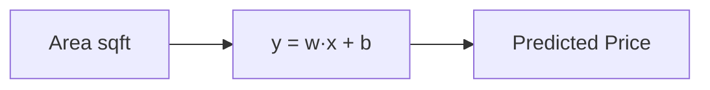

# Module 03 — Regression: Predicting Numbers

> Your first real models. Regression predicts a continuous number — price, temperature, demand. We build intuition, then math, then code.

---

## 3.1 The Idea: Fit a Line Through Data

Simple linear regression finds the **straight line** that best fits your data:

```
y = w·x + b
```
- `y` = prediction (e.g., house price)
- `x` = feature (e.g., area)
- `w` = weight/slope (how much price changes per unit area)
- `b` = bias/intercept (baseline price at x=0)

"Learning" = finding the `w` and `b` that make the line fit best.



## 3.2 What "Best Fit" Means — the Cost Function

"Best" = smallest total error. We measure error as **Mean Squared Error (MSE)**: average of (actual − predicted)², squared so positives and negatives don't cancel and big errors are punished more.

```
MSE = (1/n) · Σ (yᵢ − ŷᵢ)²
```
Training = adjusting `w` and `b` to minimize MSE. The algorithm (gradient descent) nudges them downhill until the error stops shrinking.

## 3.3 Your First Model in Code

```python
from sklearn.linear_model import LinearRegression
from sklearn.model_selection import train_test_split
from sklearn.metrics import mean_squared_error, r2_score
import numpy as np

X_train, X_test, y_train, y_test = train_test_split(X, y, test_size=0.2, random_state=42)

model = LinearRegression()
model.fit(X_train, y_train)          # learn w and b
pred = model.predict(X_test)         # predict on unseen data

print("Coefficients (w):", model.coef_)
print("Intercept (b):", model.intercept_)
print("RMSE:", np.sqrt(mean_squared_error(y_test, pred)))
print("R²:", r2_score(y_test, pred))
```

## 3.4 Reading the Metrics

- **RMSE** (Root Mean Squared Error) — average error in the target's units. "On average we're off by ₹X." Lower is better.
- **MAE** (Mean Absolute Error) — like RMSE but less sensitive to big outliers.
- **R²** (0–1) — fraction of variance explained. 0.85 = "the model explains 85% of the variation." Higher is better; can go negative if the model is worse than guessing the mean.

## 3.5 Multiple Linear Regression

More features, same idea — now a plane/hyperplane instead of a line:
```
y = w₁x₁ + w₂x₂ + ... + wₙxₙ + b
```
```python
# X has multiple columns; scikit-learn handles it identically
model = LinearRegression().fit(X_train, y_train)  # one weight per feature
```
Each weight tells you that feature's effect, holding others constant — useful for **interpretation**, not just prediction.

## 3.6 Polynomial Regression — Curves, Not Just Lines

When the relationship bends, add polynomial features (x², x³) so a linear model can fit curves:
```python
from sklearn.preprocessing import PolynomialFeatures
from sklearn.pipeline import make_pipeline

model = make_pipeline(PolynomialFeatures(degree=2), LinearRegression())
model.fit(X_train, y_train)
```
> ⚠️ High degrees overfit fast — a degree-10 polynomial will wiggle through every training point and fail on new data. Start low.

## 3.7 Regularization — the Cure for Overfitting

Regularization penalizes large weights, keeping the model simpler and more general.

- **Ridge (L2)** — shrinks weights toward zero (rarely exactly zero). Good default.
- **Lasso (L1)** — can push weights to *exactly* zero → automatic **feature selection**.
- **ElasticNet** — a blend of both.

```python
from sklearn.linear_model import Ridge, Lasso
ridge = Ridge(alpha=1.0).fit(X_train, y_train)   # alpha = strength of the penalty
lasso = Lasso(alpha=0.1).fit(X_train, y_train)    # bigger alpha = simpler model
```
`alpha` is a **hyperparameter**: too small = overfits, too large = underfits. Tune it (Module 08).

> **Scale your features before Ridge/Lasso** — the penalty is unfair otherwise (big-scale features get penalized more).

## 3.8 Assumptions & Diagnostics (why a model might mislead)

Linear regression assumes a roughly linear relationship, independent errors, and constant error spread. Check with a **residual plot** (errors vs predictions):
```python
import matplotlib.pyplot as plt
residuals = y_test - pred
plt.scatter(pred, residuals); plt.axhline(0, color='red')
plt.xlabel('Predicted'); plt.ylabel('Residual'); plt.show()
```
Residuals should look like random scatter around 0. Patterns (a curve, a funnel) mean the model is missing something — engineer features or use a non-linear model.

## 3.9 When to Use What

- **Linear/Ridge:** interpretable baseline; relationships roughly linear.
- **Lasso:** many features, want automatic selection.
- **Polynomial:** clear curvature, few features.
- **Tree-based regressors (next modules):** complex non-linear relationships, less prep.

Always start with a **simple linear baseline** — you need something to beat.

---

## ✅ Key Takeaways
1. Regression fits `y = w·x + b`; training minimizes **MSE**.
2. Evaluate with **RMSE/MAE** (error size) and **R²** (variance explained).
3. **Polynomial features** let linear models fit curves — but overfit if too high.
4. **Regularization** (Ridge/Lasso) fights overfitting; Lasso also selects features.
5. **Scale features** before regularized models.
6. **Residual plots** reveal what the model is missing. Always start with a simple baseline.

## 🏋️ Exercises
1. Train `LinearRegression` on any numeric dataset; report RMSE and R².
2. Add `PolynomialFeatures(degree=2)` — does test R² improve or overfit?
3. Compare Ridge with `alpha=0.1, 1, 10`. Plot how coefficients shrink.
4. Make a residual plot and interpret it — is the linear assumption OK?

## 🛠️ Mini-Project
Predict house prices (California Housing, built into sklearn). Baseline linear → add engineered features → Ridge with tuned alpha. Report RMSE improvement at each step.

**Next:** [Module 04 — Classification →](module-04-classification.md)

---

*🤖 Machine Learning Mastery — [PJ's Academy](https://pjsacademy.com)*
