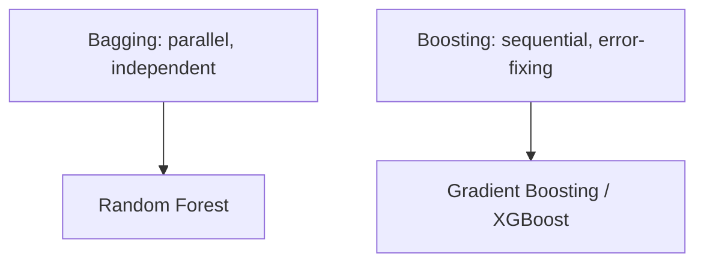

# Module 05 — Ensembles: The Models That Win

> One tree is weak. A thousand trees voting together is state-of-the-art on tabular data. This is what wins Kaggle and ships in industry.

---

## 5.1 The Core Idea: Wisdom of Crowds

An **ensemble** combines many models so their errors cancel out. A crowd of diverse, decent models beats one "genius" model. Two main flavours:

- **Bagging** (parallel) — train many models on random subsets, average them. Reduces **variance** (overfitting). → **Random Forest**
- **Boosting** (sequential) — each model fixes the previous one's mistakes. Reduces **bias**. → **Gradient Boosting / XGBoost**



## 5.2 Random Forest — many trees, one vote

Trains many decision trees, each on a random sample of rows **and** a random subset of features, then averages (regression) or votes (classification). The randomness makes trees diverse so their mistakes cancel.

```python
from sklearn.ensemble import RandomForestClassifier
rf = RandomForestClassifier(n_estimators=300, max_depth=None,
                            max_features='sqrt', random_state=42, n_jobs=-1)
rf.fit(X_train, y_train)
```
- **Robust, little tuning, no scaling needed** — a fantastic default.
- Handles non-linearity and interactions automatically.
- Gives **feature importance** for free.
```python
import pandas as pd
pd.Series(rf.feature_importances_, index=X.columns).sort_values(ascending=False).head(10)
```

## 5.3 Gradient Boosting — learn from mistakes

Builds trees **sequentially**; each new tree predicts the **residual errors** of the combined previous trees. Slowly, greedily, it drives error down. Usually the **most accurate** on tabular data.

```python
from sklearn.ensemble import GradientBoostingClassifier
gb = GradientBoostingClassifier(n_estimators=300, learning_rate=0.05,
                                max_depth=3, random_state=42)
gb.fit(X_train, y_train)
```

## 5.4 XGBoost — the industry favourite

A fast, regularized, highly-optimized gradient boosting library. The go-to for tabular competitions and production.
```python
import xgboost as xgb
model = xgb.XGBClassifier(
    n_estimators=400, learning_rate=0.05, max_depth=6,
    subsample=0.8, colsample_bytree=0.8,   # row/feature sampling = regularization
    reg_lambda=1.0, random_state=42, eval_metric='logloss')
model.fit(X_train, y_train)
```
**Cousins:** **LightGBM** (faster on big data), **CatBoost** (handles categoricals natively). Same idea, different engines.

## 5.5 The Key Hyperparameters (boosting)

| Param | Effect | Rule of thumb |
|-------|--------|---------------|
| `n_estimators` | number of trees | more + low learning_rate = better but slower |
| `learning_rate` | how much each tree contributes | lower = more accurate, needs more trees (0.01–0.1) |
| `max_depth` | tree complexity | 3–8; deeper overfits |
| `subsample` / `colsample_bytree` | randomness | 0.7–0.9 to reduce overfitting |
| `reg_lambda` / `reg_alpha` | penalties | raise to fight overfitting |

> The classic combo: **low `learning_rate` + high `n_estimators`** + early stopping.

## 5.6 Early Stopping — don't waste trees

Stop adding trees once validation performance stops improving:
```python
model.fit(X_train, y_train,
          eval_set=[(X_val, y_val)],
          verbose=False)   # newer XGBoost: set early_stopping_rounds in the constructor
```
Prevents overfitting and saves time.

## 5.7 Bagging vs Boosting — when to use which

- **Random Forest:** safe, fast to get working, hard to overfit, minimal tuning. Great first strong model.
- **XGBoost/LightGBM:** squeeze out the best accuracy, willing to tune. Usually wins.
- Try **both**, compare on the test set with proper metrics.

## 5.8 Stacking (advanced) — models of models

Train several different models, then a "meta-model" learns to combine their predictions:
```python
from sklearn.ensemble import StackingClassifier
from sklearn.linear_model import LogisticRegression
stack = StackingClassifier(
    estimators=[('rf', rf), ('xgb', model)],
    final_estimator=LogisticRegression())
stack.fit(X_train, y_train)
```
A small extra boost when every fraction of a percent matters.

---

## ✅ Key Takeaways
1. Ensembles combine many models so errors cancel — the best tabular approach.
2. **Bagging (Random Forest)** cuts variance; **Boosting (XGBoost)** cuts bias.
3. **Random Forest** = robust default, feature importance, no scaling.
4. **XGBoost/LightGBM** = usually the most accurate; tune `learning_rate` + `n_estimators` + `max_depth`.
5. Use **early stopping** and row/feature **subsampling** to control overfitting.
6. **Stacking** squeezes out the last bit of performance.

## 🏋️ Exercises
1. Train Random Forest and XGBoost on the same data; compare ROC-AUC.
2. Plot the top-10 feature importances from a Random Forest.
3. Sweep XGBoost `learning_rate` (0.3, 0.1, 0.05) with matching `n_estimators`; observe accuracy vs time.

## 🛠️ Mini-Project
Take your Module 04 churn model and beat it with XGBoost. Tune the top 3 hyperparameters, use early stopping, and report the F1/ROC-AUC gain over the logistic baseline.

**Next:** [Module 06 — Evaluation →](module-06-evaluation.md)

---

*🤖 Machine Learning Mastery — [PJ's Academy](https://pjsacademy.com)*
