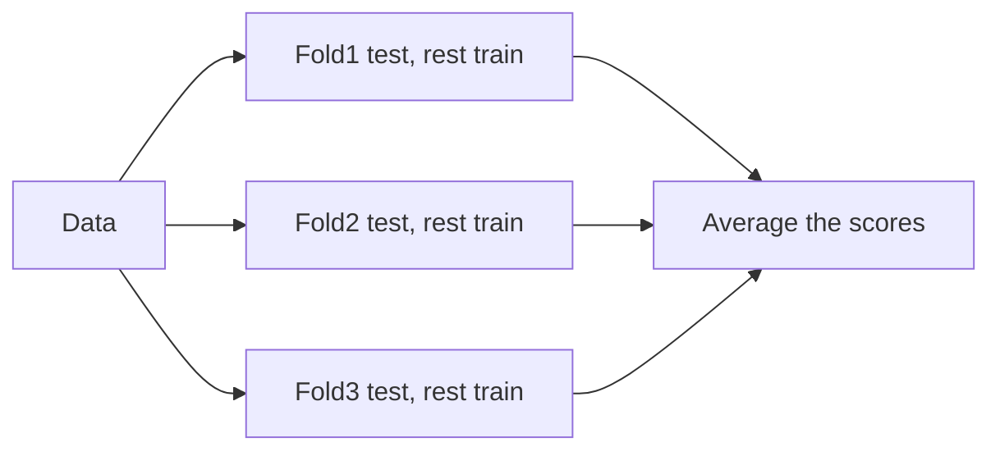

# Module 06 — Evaluation: Trusting Your Model

> A model you can't evaluate honestly is a liability. This module is what separates people who *think* their model works from people who *know*.

---

## 6.1 The One Sin: Evaluating on Training Data

Training accuracy tells you how well the model memorised — not how it'll do on new data. **Always judge on data the model never saw.** Everything here builds on that.

## 6.2 Cross-Validation — a more reliable estimate

A single train/test split is one lucky/unlucky draw. **k-fold cross-validation** splits data into k parts, trains on k−1 and tests on the held-out fold, rotating k times, then averages. You get a stable estimate + a sense of variance.



```python
from sklearn.model_selection import cross_val_score
scores = cross_val_score(model, X, y, cv=5, scoring='f1')
print(scores.mean(), "±", scores.std())
```
- Use **StratifiedKFold** for classification (keeps class balance in each fold).
- Use **TimeSeriesSplit** for time data (never train on the future!).

## 6.3 The Bias–Variance Tradeoff (the deep why)

Every model's error = **bias** + **variance** + irreducible noise.
- **High bias** (underfit) — too simple, wrong assumptions. Fix: more complex model, more features.
- **High variance** (overfit) — too sensitive to training data. Fix: more data, regularization, simpler model, ensembling (bagging).

```
Underfit ◄─────────── sweet spot ───────────► Overfit
(high bias)                                  (high variance)
```
Diagnose with a **learning curve**: plot train vs validation score as you add data.
- Both low & close → underfitting (bias).
- Big gap (train high, val low) → overfitting (variance).

```python
from sklearn.model_selection import learning_curve
# plot train_scores vs val_scores over increasing training size
```

## 6.4 Regression Metrics (recap + when)

- **RMSE** — punishes big errors; same units as target. Default.
- **MAE** — robust to outliers; "typical" error.
- **R²** — variance explained (0–1). Good for communicating.
- **MAPE** — error as a %; good for business, but breaks near zero.

## 6.5 Classification Metrics (recap + the right choice)

| Situation | Use |
|-----------|-----|
| Balanced classes, equal error cost | Accuracy is fine |
| Imbalanced classes | **F1, PR-AUC, recall** — never plain accuracy |
| Ranking / threshold-agnostic | **ROC-AUC** |
| False alarms costly | Precision |
| Misses costly | Recall |

## 6.6 The Validation Set (three-way split)

When you tune hyperparameters, you peek at the test set repeatedly → you start overfitting to it. Fix: **three splits**.
```
Train (fit params) → Validation (tune hyperparams) → Test (final, touched ONCE)
```
Or use cross-validation for tuning and keep a final held-out test set for the last, honest number.

## 6.7 Don't Leak — subtle ways test info sneaks in

- Scaling/imputing on the full dataset before splitting. → Fit on train only (use pipelines).
- Feature engineering using target statistics computed over all data.
- Time series: shuffling so future rows train the model.
- Duplicate rows across train and test.

> Leakage produces "amazing" offline scores that **collapse in production.** If a result seems too good, suspect leakage first.

## 6.8 Beyond a Single Number

- **Confusion matrix** — see *where* it's wrong (which classes get confused).
- **Residual plots** (regression) — see systematic errors.
- **Calibration** — do predicted probabilities match reality? (0.8 should be right ~80% of the time.)
- **Error analysis** — read the actual misclassified examples. This finds more improvements than any tuning.
- **Slice metrics** — check performance per segment (does it fail for one group?). Critical for fairness.

## 6.9 A Trustworthy Evaluation Checklist
- [ ] Held-out test set, touched once.
- [ ] Right metric for the problem (not just accuracy).
- [ ] Cross-validation for a stable estimate.
- [ ] No leakage (fit preprocessing on train only).
- [ ] Compared against a simple baseline.
- [ ] Looked at *where* it fails, not just the score.

---

## ✅ Key Takeaways
1. Judge only on **unseen data**; use **cross-validation** for stable estimates.
2. Error = **bias + variance**; diagnose with learning curves and fix accordingly.
3. Pick the **metric that matches the cost** — accuracy lies on imbalanced data.
4. Use a **train/validation/test** split (or CV + final test) so tuning doesn't corrupt your estimate.
5. **Leakage** is the silent killer — fit preprocessing on train only.
6. Look **beyond one number**: confusion matrix, calibration, error analysis, per-slice metrics.

## 🏋️ Exercises
1. Run 5-fold cross-validation and report mean ± std. Compare to a single split.
2. Plot a learning curve and diagnose bias vs variance.
3. Deliberately leak (scale before splitting), then do it correctly — compare the scores.
4. For 3 scenarios (fraud, spam, tumour screening), pick the metric to optimize and justify it.

**Next:** [Module 07 — Unsupervised Learning →](module-07-unsupervised.md)

---

*🤖 Machine Learning Mastery — [PJ's Academy](https://pjsacademy.com)*
