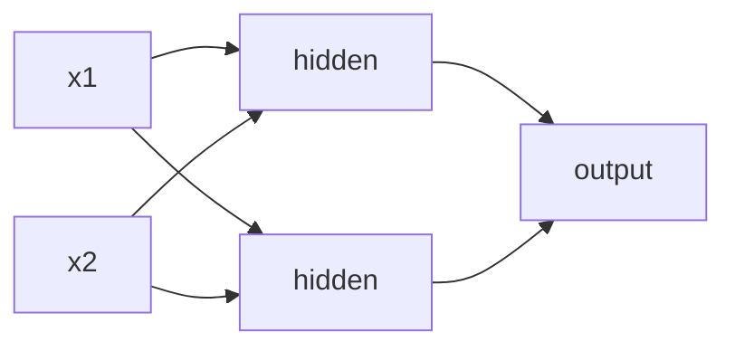

# Module 09 — Neural Networks: The Intuition

> The engine behind deep learning, image recognition, and LLMs. We build the intuition from zero, then a real network in a few lines.

---

## 9.1 What a Neuron Actually Is

A single neuron is just... logistic regression. It takes inputs, multiplies each by a weight, adds a bias, and passes the result through an **activation function**.

```
output = activation( w₁x₁ + w₂x₂ + ... + b )
```

The magic isn't one neuron — it's **stacking thousands** in layers so the network can learn very complex patterns.



## 9.2 Layers

- **Input layer** — one node per feature.
- **Hidden layers** — where the learning happens; more layers = "deeper" = can learn more complex patterns.
- **Output layer** — 1 node for regression/binary, N nodes for N-class classification.

"Deep learning" just means a neural network with **several hidden layers**.

## 9.3 Activation Functions (why networks beat linear models)

Without activations, stacking layers would collapse back into one linear equation. Activations add **non-linearity**, letting networks bend and curve to fit anything.

- **ReLU** (`max(0, x)`) — the default for hidden layers. Fast, works great.
- **Sigmoid** — squashes to 0–1, for binary output probability.
- **Softmax** — turns outputs into probabilities that sum to 1, for multi-class output.

## 9.4 How a Network Learns: Backpropagation (intuitively)

```
1. Forward pass  — data flows through, produces a prediction.
2. Loss          — measure how wrong the prediction is.
3. Backward pass — compute how much each weight contributed to the error (gradients).
4. Update        — nudge every weight to reduce the error (gradient descent).
5. Repeat        — over many passes (epochs) until the loss stops dropping.
```
You don't compute this by hand — the framework does. But knowing the loop demystifies training.

## 9.5 Key Training Concepts

| Term | Meaning |
|------|---------|
| **Epoch** | One full pass through the training data |
| **Batch size** | How many samples processed before a weight update |
| **Learning rate** | Step size of each update (too big = unstable, too small = slow) |
| **Optimizer** | The update rule — **Adam** is the go-to default |
| **Loss function** | What we minimize (MSE for regression, cross-entropy for classification) |

## 9.6 Your First Neural Network (Keras)

```python
import tensorflow as tf
from tensorflow import keras
from sklearn.preprocessing import StandardScaler

# ALWAYS scale inputs for neural nets
X_train_s = StandardScaler().fit_transform(X_train)

model = keras.Sequential([
    keras.layers.Dense(64, activation='relu', input_shape=(X_train.shape[1],)),
    keras.layers.Dropout(0.3),                     # regularization (see 9.7)
    keras.layers.Dense(32, activation='relu'),
    keras.layers.Dense(1, activation='sigmoid'),   # binary classification
])

model.compile(optimizer='adam',
              loss='binary_crossentropy',
              metrics=['accuracy'])

history = model.fit(X_train_s, y_train,
                    epochs=30, batch_size=32,
                    validation_split=0.2)          # watch val loss for overfitting
```
That's a real, working deep-learning model. For regression, use `Dense(1)` with no activation and `loss='mse'`.

## 9.7 Fighting Overfitting in Neural Nets

Networks overfit easily (millions of parameters). Tools:
- **Dropout** — randomly "turn off" neurons during training so the net can't rely on any one path.
- **Early stopping** — stop when validation loss stops improving.
- **More data / augmentation** — the best cure.
- **L2 regularization** (weight decay) — penalize large weights.

```python
early = keras.callbacks.EarlyStopping(patience=5, restore_best_weights=True)
model.fit(X_train_s, y_train, epochs=100, validation_split=0.2, callbacks=[early])
```

## 9.8 When To Use Neural Nets (and when not to)

**Use them for:** images (CNNs), text/sequences (Transformers), audio, and very large datasets with complex patterns.

**Don't bother for:** typical tabular business data — **XGBoost/LightGBM usually beat neural nets there**, train faster, and need less data and tuning. Reach for deep learning when the data is unstructured (pixels, text, sound) or huge.

## 9.9 The Deep Learning Family (map for further study)

- **CNN** (Convolutional) — images.
- **RNN / LSTM** — sequences (older).
- **Transformer** — text, and now everything; powers LLMs.
- **Autoencoder** — compression, anomaly detection.
- **GAN / Diffusion** — generation (images, art).

This module is your on-ramp; a dedicated Deep Learning course goes deeper into each.

---

## ✅ Key Takeaways
1. A neuron = weighted sum + **activation**; stacking many in layers learns complex patterns.
2. **Activations** (ReLU/sigmoid/softmax) add the non-linearity that makes networks powerful.
3. Networks learn by **forward pass → loss → backprop → update**, repeated over epochs.
4. **Adam** optimizer + right loss (cross-entropy/MSE); always **scale inputs**.
5. Fight overfitting with **dropout, early stopping, more data**.
6. For **tabular data, XGBoost usually wins** — use deep learning for images/text/audio/huge data.

## 🏋️ Exercises
1. Build a Keras network for a binary classification dataset; plot train vs val loss.
2. Add/remove Dropout and compare overfitting.
3. Compare your neural net vs XGBoost on the same tabular data — which wins, and why?
4. Change the learning rate (0.1, 0.001) and observe training stability.

## 🛠️ Mini-Project
Build a neural network to classify handwritten digits (MNIST, built into Keras). Reach >97% test accuracy. Then compare training time and accuracy against a Random Forest on the same data.

**Next:** [Module 10 — ML in Production →](module-10-production.md)

---

*🤖 Machine Learning Mastery — [PJ's Academy](https://pjsacademy.com)*
