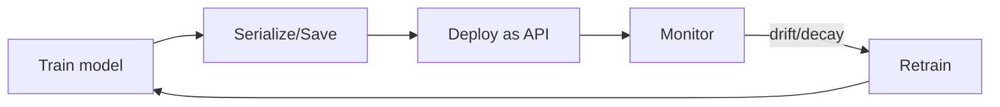

# Module 10 — Machine Learning in Production

> A model in a notebook makes ₹0. A model serving real users makes the difference. This is what turns a data scientist into an ML engineer.

---

## 10.1 The Gap Between Notebook and Product

Most ML projects die in notebooks. Production means: the model runs reliably, on real requests, keeps working as the world changes, and you know when it breaks. That's a different discipline from getting a good test score.



## 10.2 Saving & Loading Models

```python
import joblib
joblib.dump(model, 'model.pkl')        # save the trained model (+ the preprocessing pipeline!)
model = joblib.load('model.pkl')       # load anywhere for inference
```
> **Save the whole pipeline** (preprocessing + model), not just the model — inference must apply identical transforms. This is why pipelines (Module 08) matter.

## 10.3 Serving a Model as an API (FastAPI)

```python
from fastapi import FastAPI
from pydantic import BaseModel
import joblib, numpy as np

app = FastAPI()
model = joblib.load('model.pkl')

class Input(BaseModel):
    age: float
    income: float
    tenure: int

@app.post('/predict')
def predict(x: Input):
    features = np.array([[x.age, x.income, x.tenure]])
    prob = float(model.predict_proba(features)[0][1])
    return {'churn_probability': round(prob, 3),
            'decision': 'high_risk' if prob > 0.5 else 'low_risk'}
# run: uvicorn app:app --reload   →   POST JSON to /predict
```
Now any app, website, or service can get predictions over HTTP. Containerize with **Docker** to deploy anywhere.

## 10.4 The Big Enemy: Drift

The world changes; your training data doesn't. Performance silently decays. Two kinds:
- **Data drift** — input distribution shifts (new customer demographics, inflation changes incomes).
- **Concept drift** — the relationship itself changes (what predicted churn in 2023 differs in 2026).

**Detect it:** monitor input feature distributions and prediction distributions over time; track live accuracy when labels arrive.
```python
# Simple drift check: compare recent feature stats to training stats
# Production tools: Evidently, whylogs, Arize, Fiddler
```

## 10.5 Monitoring in Production

Track:
- **Model metrics** — accuracy/precision when ground truth arrives (often delayed).
- **Data health** — nulls, ranges, new categories, drift.
- **System metrics** — latency, error rate, throughput.
- **Business metrics** — did it actually move the KPI it was built for?

Set **alerts** so you find problems before users do. A model with no monitoring is a liability.

## 10.6 Retraining Strategy

- **Scheduled** — retrain weekly/monthly on fresh data.
- **Triggered** — retrain when drift or performance drop crosses a threshold.
- **Always validate** the new model against the current one before promoting (champion/challenger).

## 10.7 MLOps — the discipline

Bringing software engineering rigour to ML:
- **Version everything** — data, code, model (DVC, MLflow).
- **Experiment tracking** — log every run's params + metrics (MLflow).
- **Model registry** — versioned models with stages (staging → production).
- **CI/CD** — automated testing + deployment pipelines.
- **Reproducibility** — anyone can rebuild the exact model.

```python
import mlflow
with mlflow.start_run():
    mlflow.log_params(params)
    mlflow.log_metric('roc_auc', score)
    mlflow.sklearn.log_model(model, 'model')
```

## 10.8 Responsible & Fair ML

- **Bias/fairness** — check performance per group (gender, region); a model can be accurate overall yet unfair to a subgroup.
- **Explainability** — SHAP/feature importance so decisions can be justified (essential in finance, healthcare, hiring).
- **Privacy** — don't train on data you shouldn't; mask PII.
- **Human oversight** — keep a human in the loop for high-stakes decisions.

```python
import shap
explainer = shap.TreeExplainer(model)
shap.summary_plot(explainer.shap_values(X_test), X_test)   # why the model decides
```

## 10.9 The Real-World Pitfalls Checklist
- [ ] Saved the **full pipeline**, not just the model.
- [ ] Handled **unknown categories / missing values** at inference.
- [ ] **Monitoring + alerts** for drift and performance.
- [ ] A **retraining** plan.
- [ ] **Fairness + explainability** checked.
- [ ] A **simple baseline** in production to compare against.
- [ ] **Rollback** plan if the new model misbehaves.

---

## ✅ Key Takeaways
1. Production ML = reliable serving + monitoring + retraining, not just a good test score.
2. **Save the whole pipeline**; serve it via an **API** (FastAPI + Docker).
3. **Drift** silently kills models — monitor inputs, predictions, and live metrics.
4. Have a **retraining strategy** and validate challengers before promoting.
5. **MLOps** brings versioning, tracking, registries, and CI/CD to ML.
6. Build **fair, explainable** models with human oversight for high-stakes calls.

## 🏋️ Exercises
1. Save a trained pipeline and load it in a fresh script to predict.
2. Wrap a model in a FastAPI `/predict` endpoint and test it with a sample request.
3. Simulate drift (shift a feature's mean) and describe how you'd detect it.
4. Use SHAP to explain 3 individual predictions.

## 🛠️ Capstone Project
Take your best model from any earlier module and **productionize it**: save the full pipeline → FastAPI endpoint → a simple monitoring script that logs prediction distributions → a written retraining plan. This is the project that proves you're job-ready.

## 🎓 Course Complete!
You've gone from "what is a model?" to building, evaluating, tuning, and deploying real ML — with 10 modules and 15 projects. Next: the **Deep Learning** course, **LLM & AI Agents Mastery**, or apply it all in a Kaggle competition.

---

*🤖 Machine Learning Mastery — [PJ's Academy](https://pjsacademy.com)*
