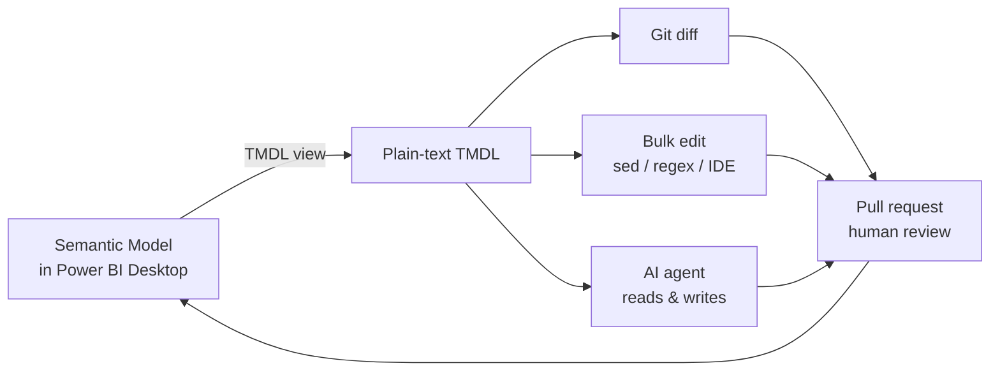
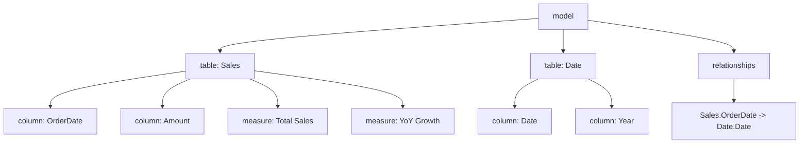
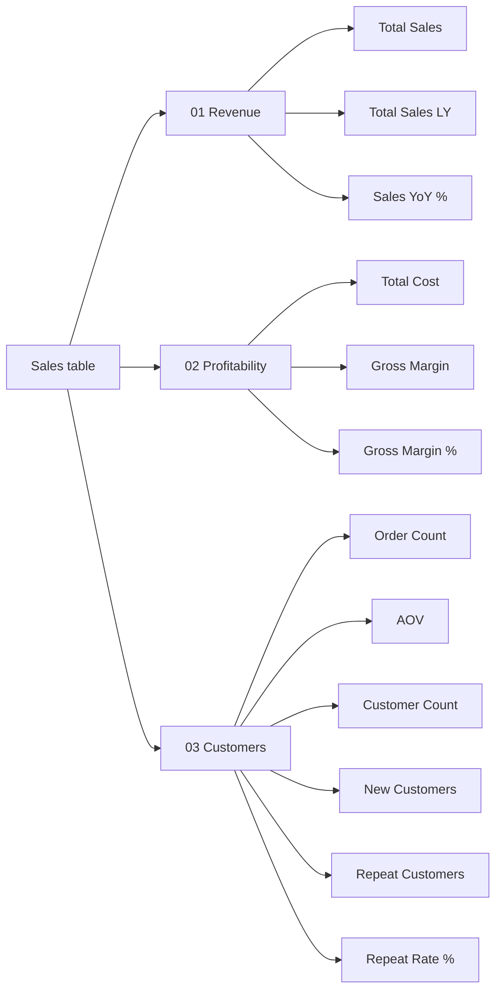

# Module 1 — TMDL View

**TMDL** = Tabular Model Definition Language. It's your whole semantic
model expressed as plain text, with Python/YAML-like indentation. Open
TMDL view inside Power BI Desktop and you can edit tables, columns,
measures and relationships as code — no clicking through a GUI.

## Why it matters now

Before TMDL, a Power BI model was a sealed binary blob (`.pbix`). You
couldn't diff it, you couldn't bulk-edit, you couldn't review it in a
pull request, and you couldn't let an AI touch it safely. TMDL fixes all
four. Every later module in this course assumes you are comfortable
reading and editing TMDL.

## The mental model



The core move: a round-trip between the Desktop UI and the text. You
author in whichever is faster — the UI for one measure, the text for
twenty.

## The TMDL object hierarchy



Each level maps to a block of indented TMDL. Learning the hierarchy is
most of learning TMDL.

## Hands-on walkthrough

### 1. Open TMDL view

In Power BI Desktop → **View** ribbon → **Model view** → the TMDL button
(looks like `</>`). You now see a text pane next to the diagram.

### 2. Read a measure

Click any measure in the model. The TMDL pane shows:

```tmdl
measure 'Total Sales' = SUM ( Sales[Amount] )
    formatString: "\$#,##0"
    displayFolder: KPIs
```

Indentation matters. One tab (or four spaces) consistently.

### 3. Add a measure as text

Type a new measure directly:

```tmdl
measure 'Total Sales LY' =
    CALCULATE (
        [Total Sales],
        SAMEPERIODLASTYEAR ( 'Date'[Date] )
    )
    formatString: "\$#,##0"
    displayFolder: KPIs
    description: "Prior-year equivalent of Total Sales."
```

Hit **Apply changes**. The measure appears in the model instantly.

### 4. Bulk-rename a display folder

Suppose you have 40 measures in `displayFolder: KPIs` and you want
`displayFolder: 01 KPIs` (so it sorts first).

- Click the **table** header in the TMDL pane (not a single measure) to
  get the whole table's TMDL.
- Find/replace `displayFolder: KPIs` → `displayFolder: 01 KPIs`.
- Apply. All 40 measures move. Try that with the GUI.

### 5. See where TMDL lives on disk

Save the file as a **PBIP** (Module 3) and look at the folder:

```
MyReport.SemanticModel/
├── definition/
│   ├── tables/
│   │   ├── Sales.tmdl
│   │   └── Date.tmdl
│   ├── relationships.tmdl
│   ├── model.tmdl
│   └── database.tmdl
└── definition.pbism
```

Every table is its own file. This is why Git can diff a semantic model.

## A worked example: refactor measures into display folders

Starting state — a flat list of 12 measures, no folders:

```tmdl
measure 'Total Sales' = SUM ( Sales[Amount] )
measure 'Total Sales LY' = CALCULATE ( [Total Sales], SAMEPERIODLASTYEAR ( 'Date'[Date] ) )
measure 'Sales YoY %' = DIVIDE ( [Total Sales] - [Total Sales LY], [Total Sales LY] )
measure 'Total Cost' = SUM ( Sales[Cost] )
measure 'Gross Margin' = [Total Sales] - [Total Cost]
measure 'Gross Margin %' = DIVIDE ( [Gross Margin], [Total Sales] )
measure 'Order Count' = DISTINCTCOUNT ( Sales[OrderID] )
measure 'AOV' = DIVIDE ( [Total Sales], [Order Count] )
measure 'Customer Count' = DISTINCTCOUNT ( Sales[CustomerID] )
measure 'New Customers' = ...
measure 'Repeat Customers' = ...
measure 'Repeat Rate %' = DIVIDE ( [Repeat Customers], [Customer Count] )
```

Target state — three folders:



In TMDL, append `displayFolder:` to each measure. You can do this with a
multi-cursor edit in VS Code in about 30 seconds. That edit, in the GUI,
is 12 right-clicks.

## Exercises

1. Open an existing `.pbix` you own. Save as PBIP. Open TMDL view. Rename
   one measure both ways: once in the GUI, once in TMDL. Note which
   feels faster for one measure, which for twenty.
2. Add a `description:` to every measure in one table using TMDL alone.
3. Create a calculated column in TMDL (not the GUI). Confirm it appears
   in the field list.
4. Break the TMDL on purpose (misspell `measure` as `meausre`) and read
   the error. Learning what breaks is how you learn what works.

## Common traps

- **Mixing tabs and spaces.** TMDL is indentation-sensitive. Pick one
  per project. VS Code's "Convert indentation to tabs" fixes this.
- **Single vs double quotes.** `'Date'[Date]` uses single quotes around
  the table name because of the space-or-reserved-word rule. `Sales`
  needs no quotes. Get this wrong and the error is cryptic.
- **Dollar signs in format strings.** Escape them: `"\$#,##0"`. Without
  the backslash some tools treat `$` as a token start.
- **Forgetting to click Apply changes.** Edits in TMDL view are not live
  until you apply. The yellow bar at the top is easy to miss.

## Further reading

- Microsoft Learn: *Tabular Model Definition Language (TMDL) overview*.
- The `pbi-tools` project on GitHub for scripted TMDL manipulation.
- `tabular-editor` docs — Tabular Editor's scripting API uses the same
  object model.

Next: [Module 2 — User-defined functions (UDFs)](./02-udfs.md).
