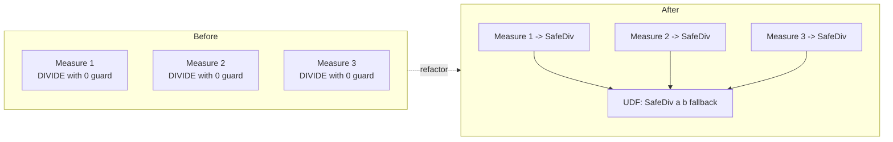

# Module 2 — User-defined functions (UDFs)

A **DAX UDF** is a function you define once, with named parameters, and
then call from any measure or calculated column. Think `def` in Python,
or `CREATE FUNCTION` in SQL — finally arriving in DAX.

## Why it matters now

Before UDFs, DAX had no first-class way to abstract a calculation.
"Safe division", "same-period-last-year", "percent-of-total" lived as
copy-pasted patterns across dozens of measures. One typo, 40 bugs. UDFs
end that. They also matter for AI-authored measures: an agent that
writes DAX against your UDF library produces consistent, reviewable code.

## The mental model



One source of truth. Fix the UDF, fix every caller.

## Hands-on walkthrough

### 1. Define a UDF in TMDL

In TMDL view, under the model root (not inside a table):

```tmdl
function 'SafeDiv' =
    (numerator: DOUBLE, denominator: DOUBLE, fallback: DOUBLE = 0) =>
        IF ( denominator = 0, fallback, DIVIDE ( numerator, denominator ) )
    description: "Division with a configurable fallback when the denominator is zero."
```

Points to notice:

- Parameters are **typed** (`DOUBLE`, `INT64`, `STRING`, `DATETIME`,
  `BOOLEAN`, or `TABLE`).
- `fallback: DOUBLE = 0` sets a default. Callers can omit it.
- The body is an expression after `=>`, same as a lambda.

### 2. Call the UDF from a measure

```tmdl
measure 'Gross Margin %' = SafeDiv ( [Gross Margin], [Total Sales] )
measure 'Return Rate %' = SafeDiv ( [Returns], [Total Sales], BLANK () )
```

Both measures use the same guard logic. The second overrides the
default fallback.

### 3. A table-valued UDF

UDFs can return tables, which lets you abstract filter contexts:

```tmdl
function 'LastNDays' =
    (n: INT64) =>
        VAR Today = MAX ( 'Date'[Date] )
        RETURN
            FILTER ( ALL ( 'Date' ), 'Date'[Date] > Today - n && 'Date'[Date] <= Today )
    description: "Returns the last N days ending at the latest date in context."
```

Call it inside `CALCULATE`:

```tmdl
measure 'Sales L7D' = CALCULATE ( [Total Sales], LastNDays ( 7 ) )
measure 'Sales L30D' = CALCULATE ( [Total Sales], LastNDays ( 30 ) )
```

Compare to the pre-UDF version where each measure embeds the same
`FILTER (ALL ... )` block.

## A UDF library you can steal

```tmdl
function 'SafeDiv' =
    (n: DOUBLE, d: DOUBLE, fallback: DOUBLE = 0) =>
        IF ( d = 0, fallback, DIVIDE ( n, d ) )

function 'PctOfTotal' =
    (value: DOUBLE, total: DOUBLE) =>
        SafeDiv ( value, total, 0 )

function 'YoYDelta' =
    (currentMeasure: DOUBLE, priorMeasure: DOUBLE) =>
        currentMeasure - priorMeasure

function 'YoYPct' =
    (currentMeasure: DOUBLE, priorMeasure: DOUBLE) =>
        SafeDiv ( currentMeasure - priorMeasure, priorMeasure )

function 'FormatSignedPct' =
    (x: DOUBLE) =>
        IF ( x >= 0, "+" & FORMAT ( x, "0.0%" ), FORMAT ( x, "0.0%" ) )
```

Starting a new model? Paste this at the top of your TMDL and your
measures get 30 % shorter.

## When NOT to use a UDF

- Trivial one-liners (`SUM(Sales[Amount])`) — a UDF adds indirection
  with no benefit.
- Logic that depends on `SELECTEDVALUE` of a specific slicer — UDFs are
  pure functions of their parameters; smuggling filter context in
  through the back door makes them harder to reason about.
- As a replacement for calculation groups. Calc groups are for
  time-intelligence selectors; UDFs are for reusable expressions.

## Exercises

1. Open an existing model with at least 15 measures. Count how many
   contain `IF ( ... = 0, 0, DIVIDE ...)`. Refactor them to `SafeDiv`.
2. Write a `PriorPeriod` UDF that takes a measure and a date column and
   returns the equivalent for the same period last year. Use it to
   collapse three measures into one.
3. Write a `MedianX` UDF (DAX has `MEDIAN` but not `MEDIANX` on an
   expression). Verify against a known dataset.
4. Deliberately pass the wrong type to a UDF. Note the error. UDFs give
   you type checking you didn't have before.

## Common traps

- **Scope confusion.** UDFs live at the model level, not inside a table.
  Define them under `model` in TMDL.
- **Recursion is not supported.** A UDF cannot call itself (yet).
  Workaround: unroll a few levels, or use `GENERATESERIES` + `SUMX`.
- **Performance.** UDFs are compile-time inlined; a measure using a UDF
  is as fast as one with the body spelled out. But a UDF that wraps a
  slow expression is still slow — abstraction doesn't fix bad DAX.
- **Versioning.** Change a UDF's signature and every caller breaks.
  Treat UDFs like a public API: add a new one before deleting the old.

## Further reading

- Microsoft Learn: *DAX user-defined functions*.
- SQLBI articles on DAX function design (predates UDFs but the design
  advice carries over).

Next: [Module 3 — PBIP + Git](./03-pbip-git.md).
