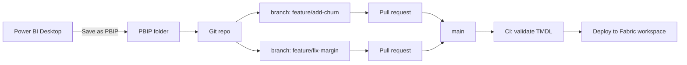
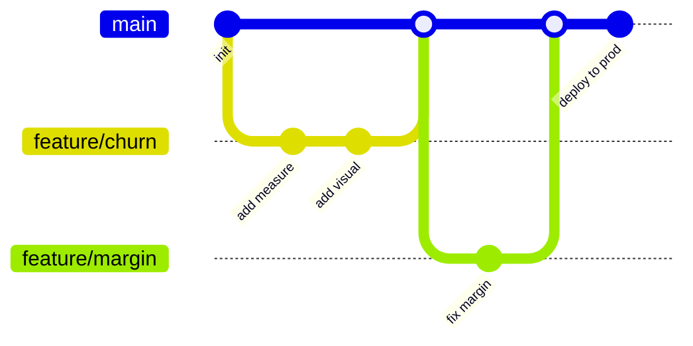

# Module 3 — PBIP + Git

**PBIP** = Power BI Project format. Instead of saving as one binary
`.pbix` file, you save as a folder of text files that Git can diff,
review, branch and merge. Pair it with Git and you get the
software-engineering practices Power BI was missing: pull requests, code
review, CI/CD, rollback.

## Why it matters now

Every "serious" data tool — dbt, SQL migrations, Airflow DAGs — treats
code as the source of truth. Power BI stayed binary for a decade.
PBIP ends that. For 2027 and beyond, assume every enterprise client
wants their Power BI assets in Git.

## The mental model



Same workflow a backend team uses, applied to a semantic model.

## What a PBIP folder looks like

```
MyReport/
├── MyReport.Report/
│   ├── definition/
│   │   ├── pages/
│   │   │   ├── page1/
│   │   │   │   ├── page.json
│   │   │   │   └── visuals/
│   │   │   │       ├── visual-abc.json
│   │   │   │       └── visual-def.json
│   │   │   └── page2/...
│   │   └── report.json
│   └── definition.pbir
├── MyReport.SemanticModel/
│   ├── definition/
│   │   ├── tables/
│   │   │   ├── Sales.tmdl
│   │   │   └── Date.tmdl
│   │   ├── relationships.tmdl
│   │   ├── model.tmdl
│   │   └── database.tmdl
│   └── definition.pbism
├── .gitignore
└── MyReport.pbip   <- small pointer file; open this in Desktop
```

Two artefacts, two folders: a Report and a SemanticModel. They can also
live in separate repos if a central model serves many reports — the
"thin report" pattern.

## Hands-on walkthrough

### 1. Save a report as PBIP

Power BI Desktop → **File → Save as** → change filter to
*Power BI project files (\*.pbip)*. Pick a folder. Desktop writes the
tree above.

### 2. Initialise Git

```bash
cd MyReport
git init
git add .
git commit -m "Initial PBIP checkpoint"
```

Use the Microsoft-provided `.gitignore` template for PBIP (search
"PBIP gitignore" on Microsoft Learn). It excludes `.pbi/`, cache, and
local user settings that don't belong in version control.

### 3. Make a change and see the diff

Add a measure in Desktop, save, then:

```bash
git diff
```

You will see a clean textual diff of `Sales.tmdl`:

```diff
+ measure 'Churn Rate %' =
+     SafeDiv (
+         [Churned Customers],
+         [Customer Count]
+     )
+     formatString: "0.0%"
+     displayFolder: "03 Customers"
```

Compare that to pre-PBIP, where "a measure changed" meant a 400 KB
binary blob changed and nobody could tell what.

### 4. Branch, PR, review

```bash
git checkout -b feature/add-churn
# edit model in Desktop or TMDL
git commit -am "Add Churn Rate % measure"
git push -u origin feature/add-churn
```

Open a PR on GitHub / Azure DevOps / GitLab. Reviewers see the TMDL diff
inline. Approve, merge, done. This is the exact workflow a Python team
has used for 15 years.

### 5. Deploy from the PBIP

Three common paths:

| Path | How | When to use |
|---|---|---|
| **Fabric Git integration** | Connect the workspace to the Git repo. On merge to `main`, Fabric syncs. | Simplest. Default for new work. |
| **Fabric Deployment Pipelines + REST** | CI job calls Fabric REST API to deploy the PBIP. | When you need gated promotion dev → test → prod. |
| **Power BI Desktop + manual publish** | Open the `.pbip` in Desktop, Publish. | Local prototyping only; don't ship this way. |

## CI example: validate TMDL on every push

`.github/workflows/pbip-validate.yml`:

```yaml
name: Validate PBIP
on:
  pull_request:
    paths:
      - '**/*.tmdl'
      - '**/*.pbir'
      - '**/*.pbism'
jobs:
  validate:
    runs-on: windows-latest
    steps:
      - uses: actions/checkout@v4
      - name: Install pbi-tools
        run: dotnet tool install -g pbi-tools.netcore
      - name: Compile model
        run: pbi-tools compile MyReport
      - name: Run Best Practice Analyzer rules
        run: pbi-tools analyze MyReport --rules .bpa/rules.json
```

Catches bad TMDL and anti-patterns before they reach the Service.

## Branch strategy that actually works for Power BI



- Short-lived feature branches, one logical change each.
- `main` is deployable; always matches the Dev or Test workspace.
- Prod deployment is a tag, not a branch. Rolling back = redeploy a
  previous tag.

## Exercises

1. Convert an existing `.pbix` to PBIP. Commit. Make three small
   changes, each in its own commit. Read `git log --stat`.
2. Create a feature branch, add a measure, open a PR against yourself.
   Review your own diff out loud — would a reviewer understand?
3. Set up `.gitignore` from the Microsoft template. Confirm `cache/`
   and user state are excluded.
4. Add a GitHub Action that fails on any TMDL file over 500 lines
   (encourages splitting big tables).

## Common traps

- **Merge conflicts in visual JSON.** Two people edit the same page →
  JSON conflict in `visual-xyz.json`. Resolvable but ugly. Solution:
  split work by page or by table.
- **Committing the `cache/` folder.** Blows up repo size. Always
  `.gitignore` it.
- **Opening the Report folder, not the `.pbip` pointer.** Desktop needs
  the `.pbip` file; the folders alone won't open directly.
- **Thin report + shared model drift.** If a thin report lives in repo A
  and its semantic model in repo B, pin the model version somewhere.
  Otherwise the report breaks silently when the model changes.
- **Secrets in `database.tmdl`.** Connection strings sometimes leak
  passwords. Parameterise connections; keep real credentials in the
  Service's data source settings.

## Further reading

- Microsoft Learn: *Power BI Projects (PBIP) overview*.
- Microsoft Learn: *Fabric Git integration*.
- `pbi-tools` GitHub project.
- Rui Romano's blog — he drove much of PBIP's design.

Next: [Module 4 — MCP + AI agents](./04-mcp-ai-agents.md).
