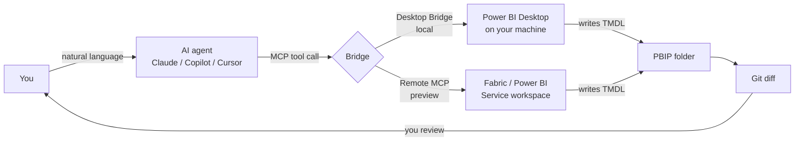
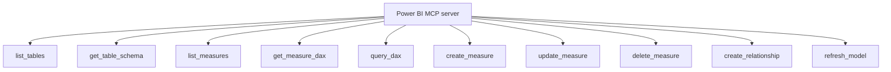
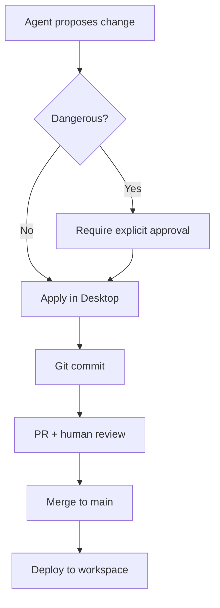

# Module 4 — MCP + AI agents

**MCP** = Model Context Protocol — an open standard that lets an AI
client (Claude, Copilot, Cursor, …) call tools on a server. Microsoft
ships MCP servers for Power BI so an agent can read your semantic model,
propose changes, generate DAX, write documentation, and apply edits —
either locally through the **Desktop Bridge** or remotely through the
**Remote Power BI Authoring MCP** (preview).

This is the final skill in the four-skill prep ladder. It's last for a
reason: you need TMDL (to read what the agent writes), UDFs (to give the
agent a clean vocabulary), and PBIP + Git (to roll back when the agent
does something stupid). Without those three, agentic authoring is a
footgun.

## Why it matters now

The agentic workflow is where Power BI product investment is going.
Microsoft calls it **Power BI Agentic Experiences** and it's GA.
Developers who can supervise an agent end up 3–5× more productive on
model work. Developers who can't, won't.

## The mental model



Agent proposes, Git records, human approves. The agent is a very
competent junior; you are still the senior reviewing the PR.

## Two deployment modes

| Mode | Where the model lives | Status | Use when |
|---|---|---|---|
| **Desktop Bridge MCP** | On your Windows machine, inside Desktop | GA | Local authoring; you have Desktop open anyway. |
| **Remote Authoring MCP** | In a Fabric / Power BI workspace | Preview | CI pipelines, cloud-native agents, headless automation. |

## Hands-on walkthrough — Desktop Bridge

### 1. Install prerequisites

- Current Power BI Desktop.
- An MCP-capable client. Example: Claude Code, Claude Desktop, Cursor,
  or Copilot in VS Code.

### 2. Configure your MCP client

Example `~/.claude/mcp.json` for Claude Code:

```json
{
  "mcpServers": {
    "powerbi-desktop": {
      "command": "pbi-mcp",
      "args": ["--mode", "desktop-bridge"]
    }
  }
}
```

Equivalent for Cursor / VS Code uses their own `mcp.json`. Check the
docs for your client — the exact file path moves around.

### 3. Open a PBIP in Desktop

The bridge needs a running Desktop instance with your PBIP open. Agents
cannot (yet) spawn Desktop headlessly through the Bridge.

### 4. Ask the agent to do something

```
You: Read the Sales table and propose five KPI measures a sales
     manager would want. Add them to a new display folder called
     "01 Manager KPIs".

Agent: [calls MCP tool: get_table("Sales")]
       [calls MCP tool: get_measures()]
       [proposes 5 measures in TMDL]
       [calls MCP tool: write_measures(...) after your approval]
```

### 5. Review the diff

```bash
git diff
```

The agent's edits land in `Sales.tmdl` as a normal commit candidate.
Read every line. If it added a `CALCULATETABLE` where `CALCULATE` would
do, reject.

### 6. Commit or revert

```bash
git add . && git commit -m "Agent: 5 manager KPIs for Sales"
# or
git checkout .   # throw it away
```

## Tool surface typically exposed by the Power BI MCP server



Read tools are safe. Write tools should be gated by human approval in
your client — Claude Code prompts; Cursor has a per-tool allowlist.

## Patterns that work

- **Documentation generator.** "Read every measure in the model and add
  a `description:` property explaining what it computes in business
  terms." Review the TMDL diff; commit.
- **DAX refactor to UDFs.** "Find every measure that does
  `IF(x = 0, 0, DIVIDE(a, b))` and refactor to `SafeDiv(a, b)`."
- **Best-practice sweep.** "Run the Fabric BPA ruleset against this
  model and propose fixes for every High severity rule."
- **New model from a brief.** Hand the agent a one-page business brief
  and a star-schema SQL source. Get a first-draft TMDL. Expect to
  rewrite 40 % of it, but the 60 % you keep saves hours.

## Patterns that don't work (yet)

- **"Build the whole report."** Agents are poor at report-layout
  decisions; the result looks like a 2015 dashboard.
- **"Optimise performance."** They will propose vaguely plausible
  rewrites that often make things slower. Use DAX Studio.
- **Multi-turn long edits without Git checkpoints.** The agent loses
  track. Commit frequently; a 10-minute agent session is 5 commits.

## Remote Authoring MCP (preview)

Same tool surface, different endpoint:

```json
{
  "mcpServers": {
    "powerbi-remote": {
      "command": "pbi-mcp",
      "args": [
        "--mode", "remote",
        "--workspace", "https://api.fabric.microsoft.com/v1/workspaces/<id>",
        "--auth", "service-principal"
      ]
    }
  }
}
```

The agent now operates on a model deployed to a workspace, no Desktop
required. Useful for:

- Nightly CI: "diff the model against the BPA ruleset, open a GitHub
  issue if any High-severity rule fails."
- Chatbot that answers "add this measure for me" via a Teams front end.

Caveat: preview = breaking changes between monthly releases. Pin a
specific MCP server version in production.

## Exercises

1. Install an MCP client. Point it at the Desktop Bridge. Have it list
   the tables in any model you own.
2. Ask the agent to add a one-line `description:` to every measure in
   one table. Read every edit before accepting.
3. Ask the agent to generate a measure that does something wrong on
   purpose (e.g. divides without a zero guard). Reject it with a reason
   the agent can learn from.
4. Set up Git so you can `git revert` an agent commit without touching
   anything else.

## Safety and governance



Minimum controls for a team setting:

- MCP write tools require per-call approval in the client.
- All agent output goes through PBIP + Git — no agent writes to the
  Service without PR review.
- Service principals used by remote MCP have **workspace-scoped**
  permissions, never tenant-wide.
- Log every tool call. Fabric audit logs cover remote MCP; capture
  Desktop Bridge calls with your MCP client's log.

## Common traps

- **Letting the agent "just fix it" with write access, no review.**
  You will discover a broken production model on a Monday. Don't.
- **Giving the agent service-principal creds that can write to prod.**
  Give it dev only; promote through your deployment pipeline.
- **Hallucinated column names.** Agents sometimes invent columns.
  BPA rules + CI compile step catch this before deploy.
- **Prompt injection from the model's data.** Column `description`
  fields and table `description` fields are read by the agent as part
  of its context. If a user with write access to source metadata puts
  instructions there, the agent may follow them. Treat descriptions as
  untrusted input in multi-tenant settings.

## Further reading

- Microsoft Learn: *Power BI Agentic Experiences* overview.
- Microsoft Learn: *Power BI MCP server* (Desktop Bridge).
- Microsoft Learn: *Remote Power BI Authoring MCP* (preview).
- Anthropic / MCP spec: `modelcontextprotocol.io`.

Next: [Module 5 — Copilot + Fabric IQ](./05-copilot-fabric-iq.md).
