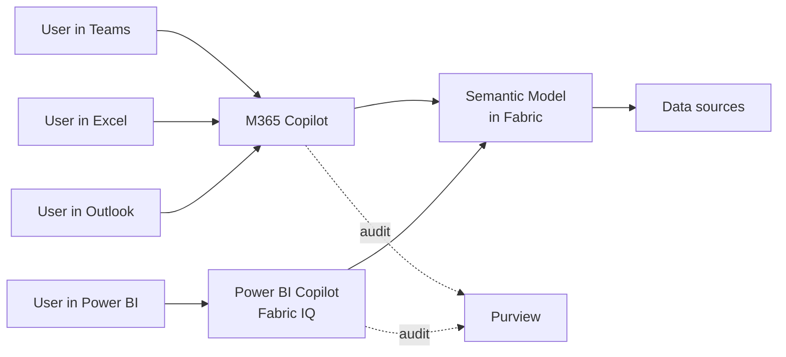

# Module 5 — Copilot + Fabric IQ

Two overlapping surfaces, often confused:

- **Microsoft 365 Copilot + Power BI** (preview) — the Copilot inside
  Word, Excel, Teams, Outlook can reach into trusted Power BI semantic
  models and answer business questions using them.
- **Fabric IQ + Power BI Copilot** (rolling GA) — Copilot inside the
  Power BI / Fabric experience itself. Reasons over a semantic model,
  generates visuals, explains results, shows the underlying DAX / PAX
  query.

Different entry points, same underlying idea: the semantic model is
the trusted vocabulary a language model uses to answer business
questions.

## Why it matters now

Executives type questions into Microsoft 365 Copilot every day. Whether
they get a useful answer depends on whether the semantic model behind
Power BI is clean, documented, and labelled correctly. Your model is
your product's AI interface, whether you planned for that or not.

## The mental model



Both Copilots route through the semantic model. If the model's labels,
descriptions and synonyms are weak, both Copilots answer badly.

## What "trusted semantic model" means in Copilot terms

A semantic model Copilot can use well has:

- **Clear table and column names.** `fact_sales_daily` is machine-y;
  `Sales` reads naturally. Pick the one your business users would say.
- **Descriptions on every measure.** Copilot reads `description:` as
  prompt context. Empty descriptions = guesswork.
- **Synonyms configured.** "Revenue", "Sales", "Top line" should all
  resolve to `[Total Sales]`.
- **Row-level security (RLS) that holds.** Copilot answers through the
  calling user's identity. A broken RLS rule leaks data to Copilot too.
- **Verified answers** (Fabric IQ feature). Register a canonical
  question → canonical measure mapping. Copilot uses the mapping
  instead of guessing.

## Hands-on walkthrough

### 1. Enable Copilot on a workspace

Fabric portal → **Admin portal → Tenant settings → Copilot** → turn on
for your workspace. Requires a Fabric F64+ or Power BI Premium capacity
(or P-SKU; or PPU for individual use).

### 2. Prepare one model for Copilot

In TMDL, add descriptions and synonyms:

```tmdl
table 'Sales'
    description: "One row per sales transaction. Grain: transaction line."

    measure 'Total Sales' = SUM ( Sales[Amount] )
        description: "Total sales amount in USD. Also known as revenue or top line."
        formatString: "\$#,##0"
        annotation PBI_FormatHint = "Currency"
        annotation Synonyms = "revenue, top line, gross sales"
```

The `Synonyms` annotation is the main hook for M365 Copilot's
Q&A-style resolution.

### 3. Ask Copilot in the Power BI Service

Open the model → Copilot pane → type:

> "What were last quarter's sales by region, with YoY growth?"

Copilot does three things visibly:

1. Generates a visual (likely a bar chart with a secondary metric).
2. Shows the DAX / PAX query it used.
3. Explains in natural language what the chart shows.

Step 2 is the one you care about as a developer. Read the DAX. If it
chose a wrong measure or a wrong filter, the fix is in the model's
descriptions and synonyms, not in a Copilot setting.

### 4. Ask via Microsoft 365 Copilot (preview)

From Teams Copilot chat with a semantic model grounded:

> "/powerbi How are North-America sales tracking vs plan this month?"

Same reasoning path, different wrapper. Answer appears in the chat with
a link back to the Power BI report.

## Fabric IQ specifically

Fabric IQ is Microsoft's umbrella for the AI reasoning layer across
Fabric (not just Power BI). For Power BI developers, three features
matter today:

- **Verified Answers.** Register the canonical measure for a canonical
  question. Copilot answers from the mapping before trying to generate
  DAX. Think "FAQ" for your semantic model.
- **Semantic model explanations.** Copilot can explain any measure in
  natural language on hover, using `description:` + the DAX body.
- **PAX visibility.** The query Copilot generates is shown and
  copy-pastable, which makes it debuggable like any other DAX.

## A review checklist before you let Copilot near a model

- [ ] Every measure has a `description:`.
- [ ] Table and column names are user-friendly (not warehouse names).
- [ ] Synonyms added for the top 20 measures.
- [ ] RLS tested with at least two personas; verify Copilot respects it.
- [ ] Date table marked as a date table; `[Date]` is the key column.
- [ ] No columns named `Measure1`, `Column2`.
- [ ] Verified Answers registered for the 5 most-asked questions.
- [ ] Sensitive measures (margin, salary, PII counts) are either
      excluded from Copilot or gated by RLS.

Skip this list and Copilot's answers will embarrass you.

## Live visuals in Outlook (preview)

Not strictly a Copilot feature but adjacent: users can embed a Power BI
visual in Outlook on the web and interact with it inside the email —
filter, cross-highlight, drill. Governance notes:

- Same RLS, same workspace permissions. Users without access see
  nothing.
- Rendering uses the recipient's identity, not the sender's.
- Don't send to external recipients unless the workspace supports
  guest access.

## Exercises

1. Pick a model you own. Count how many measures have an empty
   `description`. Write descriptions for the top 10 measures.
2. Add synonyms for your top 5 measures. Ask Copilot a question using
   each synonym. Verify it resolves correctly.
3. Deliberately give one measure a misleading description. Ask Copilot a
   question that would use it. Notice how the wrong description → wrong
   answer. Now you understand why descriptions are code.
4. Register a Verified Answer for one canonical question. Ask the
   question two different ways. Confirm Copilot uses the mapping.

## Common traps

- **"Copilot is hallucinating."** Nine times out of ten, the model is
  under-documented. The fix is in TMDL, not in Copilot settings.
- **Capacity-sized bills.** Copilot queries consume Fabric capacity
  units. A chatty executive user can blow a daily budget. Monitor.
- **Thin reports with shared models.** Copilot answers using the
  model's metadata; a thin report's layout doesn't help. Invest in the
  model.
- **Preview behaviour changes.** Microsoft tunes Copilot's prompts
  monthly. An answer that worked last week may differ this week.
  Verified Answers insulate you.

## Further reading

- Microsoft Learn: *Copilot for Power BI overview*.
- Microsoft Learn: *Fabric IQ*.
- Microsoft Learn: *Prepare your data for Copilot in Power BI*.

Next: [Module 6 — Service features and UX updates](./06-service-and-ux.md).
