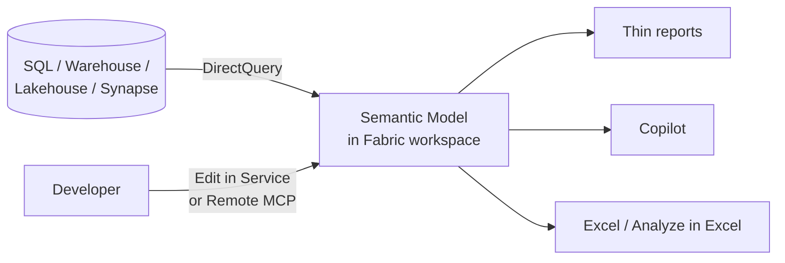
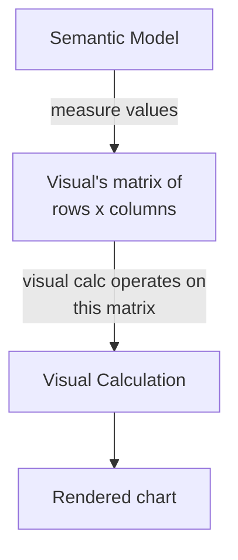

# Module 6 — Service, DirectQuery and UX updates

Grab-bag of features that aren't the headline agentic story but matter
for day-to-day work. All GA except where noted.

1. DirectQuery semantic models in the Service
2. Visual Calculations
3. Initial Axis Scroll Position
4. New Design Ribbon
5. Live Power BI visuals in Outlook (preview — see Module 5)

## 1. DirectQuery semantic models in the Service

You can now **create and edit** DirectQuery semantic models directly in
the Power BI / Fabric Service — no Desktop round-trip. The Service
authoring experience caught up to Desktop for most model edits.

### Why it matters

- Cloud-first teams can build and iterate without a Windows machine.
- CI/CD pipelines can patch a live model via Fabric REST without
  publishing a `.pbix`.
- Pairs with Remote MCP (Module 4): an agent can edit a DirectQuery
  model running in production.

### Mental model



Model stays in the Service. Queries hit the source live. Edits happen
in the browser or via API.

### When to use DirectQuery vs Import

| Use DirectQuery when | Use Import when |
|---|---|
| Source is already fast (Fabric Warehouse, Lakehouse SQL endpoint, Synapse) | Source is slow or external |
| You need real-time or near-real-time data | Daily / hourly refresh is fine |
| Data is too large to fit in Premium capacity memory | Data comfortably fits |
| RLS must live in the source for compliance | RLS in the model is OK |

Composite models (part import, part DQ) are usually the right answer
for anything non-trivial.

### Hands-on

1. In a Fabric workspace → **+ New → Semantic model → DirectQuery**.
2. Pick a source (a Fabric Lakehouse works for a quick test).
3. Drag tables in; set relationships.
4. **Open data model in Service** → edit measures, relationships,
   descriptions — all in the browser.
5. Build a thin report that connects to this model by *Live
   connection*. Keep report and model in separate PBIP folders.

### Traps

- **Latency.** Every slicer click fires queries. Measure query times in
  the Performance Analyzer before shipping.
- **Measure complexity.** Some DAX patterns (iterated `SUMX` over big
  tables) collapse to monster SQL. Use DAX Studio to inspect generated
  SQL.
- **No calculated columns on DQ tables** unless the source supports
  them. Push the calc to the source instead.

## 2. Visual Calculations (GA)

A calculation that lives **on the visual**, not in the semantic model.
It sees the visual's rows and columns the way a human reads them.

### Why it matters

Before Visual Calculations, "moving average over the current chart's
timeline" meant creating a model-level measure, polluting the model
with report-specific logic. Now the calc lives on the visual and
disappears when the visual does.

### Syntax quick tour

Inside the visual's **Add visual calculation** pane:

```dax
-- 3-period moving average of Total Sales across the visual's rows
MovingAverage = MOVINGAVERAGE([Total Sales], 3)

-- Running total down the visual
RunningSales = RUNNINGSUM([Total Sales])

-- Previous row's value
Prev = PREVIOUS([Total Sales])

-- Percentage change vs previous row
PctChange = DIVIDE([Total Sales] - PREVIOUS([Total Sales]), PREVIOUS([Total Sales]))

-- Index of the current row
Rank = RANKX(ALLSELECTED(ROWS), [Total Sales])
```

Available functions: `PREVIOUS`, `NEXT`, `FIRST`, `LAST`, `MOVINGAVERAGE`,
`RUNNINGSUM`, `RANKX`, `COLLAPSE`, `EXPAND`, `COLLAPSEALL`, `EXPANDALL`,
plus full DAX.

### Mental model



Think "spreadsheet formula on the visual's grid". `PREVIOUS` means "the
cell above", not "a time-intelligence trick".

### When to prefer Visual Calcs over model measures

| Prefer visual calc | Prefer model measure |
|---|---|
| Running totals, moving averages for one chart | Any value used in multiple reports |
| Row-over-row comparisons | Cross-report consistency |
| Rank within the visible slice | Values exposed to Copilot |
| Quick prototypes | Values with business-critical definitions |

### Trap: Copilot doesn't see visual calcs

Copilot reasons over the semantic model only. If a KPI matters to
executives via Copilot, make it a model measure (with description +
synonyms), not a visual calc.

## 3. Initial Axis Scroll Position (GA)

A category/time axis can be configured to open at the **latest** value
instead of the earliest. For an operational dashboard looking at the
last 24 hours, this is table stakes.

### How

On the X-axis properties for a chart, enable **Initial scroll
position → End**. Combine with a scrollable axis and a sensible
window.

### Why it matters

A manager opening "last 90 days of orders" wants to see today, not
Day 1. Pre-feature workaround was a `TOPN` filter that broke drill-down.

## 4. New Design Ribbon (GA)

Centralised control for themes, page size, background, wallpaper and
report styling. Not a technical feature — a UX one — but it's where
every report-styling task lives now.

### What moved there

- Theme selection and customisation (previously under View → Themes).
- Page size and orientation (previously under Format pane).
- Background / wallpaper images.
- Report-wide filter styling.

### Why it matters for your workflow

Reports that look professional in 2026 use custom themes shipped as
`.json`. Keep theme JSON in the PBIP repo:

```
MyReport/
├── themes/
│   ├── brand-light.json
│   └── brand-dark.json
```

Reference them from Design ribbon → Import theme. Version-controlled
themes = consistent look across every report in a tenant.

## 5. Live Power BI visuals in Outlook (preview)

Covered in Module 5. Short version: embed a visual in an email, the
recipient interacts with it live in Outlook on the web, RLS applies.

## Exercises

1. Build a DirectQuery model against a Fabric Lakehouse. Edit a measure
   entirely in the Service (no Desktop). Confirm the edit via a thin
   report.
2. Add a Visual Calculation to a line chart: running total + 7-point
   moving average. Note what works that would have needed a model
   measure before.
3. Open an operational dashboard chart. Flip Initial Axis Scroll to End.
4. Export your tenant's default theme as JSON, commit to Git, modify
   two colours, re-import. You now have version-controlled branding.

## Common traps across this module

- **Mixing authoring surfaces.** Edit the same model in Desktop and in
  the Service in parallel → conflicts. Pick one authoring surface per
  change; use PBIP + Git to coordinate.
- **DirectQuery with no capacity planning.** DQ workloads spike CU
  usage. Monitor Fabric capacity metrics before promoting to prod.
- **Over-using visual calcs.** Report-level logic sprawls fast. If a
  calc appears on three visuals, it belongs in the model.

## Further reading

- Microsoft Learn: *Create semantic models in the Service*.
- Microsoft Learn: *Visual calculations overview*.
- Power BI monthly release notes (search "Design ribbon",
  "Visual calculations", "Initial scroll").

Next: [Module 7 — Roadmap and skill stack](./07-roadmap-and-skill-stack.md).
