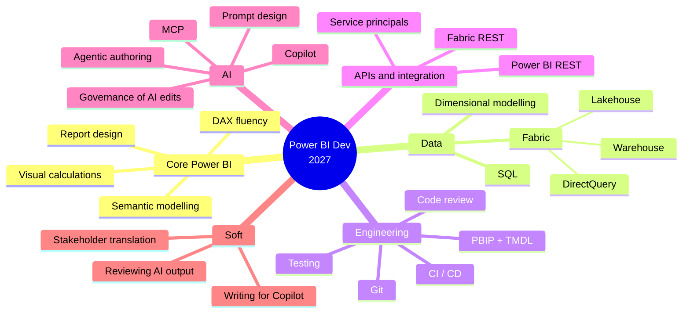
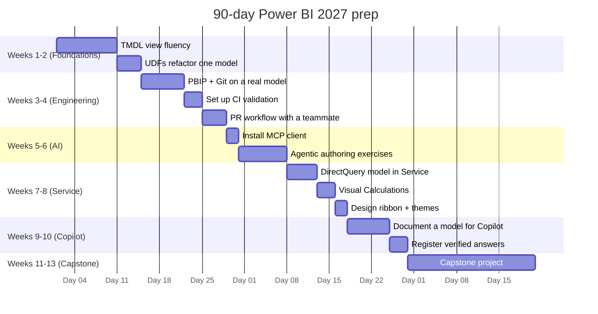

# Module 7 — The 2027 skill stack and a 90-day roadmap

The thesis of this course in one sentence: **Power BI development is
becoming analytics engineering with an AI pair.** The job description
that paid in 2022 does not pay in 2027.

## The 2027 skill stack

If you are strong in two branches and weak in four, you are a 2022
developer. Aim for competence in all six by end of 2026.

## What's dropping out

- **Expertise in `.pbix` as the unit of work.** PBIP replaces it.
- **Clicking through the UI as the primary authoring mode.** Still
  useful; no longer sufficient.
- **"I don't do code reviews."** The industry does.
- **Doing all the DAX writing yourself.** You review DAX now. The agent
  drafts.

## What's rising

- **Semantic model as product.** The model is an API consumed by humans,
  Copilots, agents, and downstream reports. Treat it like one.
- **Writing for Copilot.** Descriptions, synonyms, verified answers.
  Non-trivial craft.
- **Reviewing AI edits.** The highest-leverage skill of the next three
  years. If you can tell "subtly wrong DAX" from "correct DAX", you're
  valuable.
- **Governance.** Who can let the agent write to prod? Auditable how?
  Someone has to answer this. Might as well be you.

## 90-day roadmap

### Capstone project

Pick a dataset you care about (public or your own). Deliver:

1. A PBIP in Git with meaningful commits and at least one merged PR.
2. A semantic model with:
   - TMDL you wrote by hand for at least one table.
   - A UDF library of ≥ 3 reusable functions.
   - Descriptions and synonyms on every measure.
   - RLS with two personas.
3. A thin report that uses Visual Calculations where appropriate.
4. One Copilot interaction documented (prompt → DAX → explanation),
   with a short note on how the model's documentation helped.
5. One agent interaction (MCP) that proposes a change, which you review
   and either merge or reject with written reasoning.
6. A CI job that validates TMDL on every PR.

Portfolio piece. Push it to GitHub. Link from your CV.

## How to keep learning after the 90 days

- **Power BI monthly release notes.** Read every one. 15 minutes.
- **Microsoft Fabric blog.** The headline announcements live there.
- **Rui Romano, Chris Webb, Marco Russo / Alberto Ferrari, Reid Havens,
  Guy in a Cube.** Four blogs and one YouTube channel will keep you
  current.
- **MCP spec repo on GitHub.** Watch releases.
- **One side project per quarter.** Reading isn't learning.

## Reality check, closing

A Power BI developer who ignores this stack through 2026 will spend
2027 competing with developers who didn't. The tools are not magic;
they are learnable in a quarter of focused evenings. The hard part is
noticing in time that the ground shifted. You just did. Start Module 1.

[← Back to README](./README.md)
