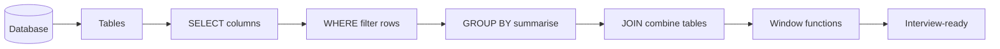

# 🗄️ SQL Mastery — PJ's Academy

**From "what is a database?" to cracking SQL interviews — with 100 practice problems solved in BOTH standard SQL and Snowflake, fully explained.**

SQL is the #1 most-requested skill in every data job. This course assumes **zero knowledge** and takes you to interview-ready, with a 100-problem bank (LeetCode-style) where every solution is commented line by line.

---

## 🎯 Who This Is For
- Complete beginners (we start from "a table is like a spreadsheet")
- Anyone prepping for data analyst / engineer / scientist interviews
- People who "kind of know SQL" but freeze on window functions and joins

## 📚 Course Structure — 8 Modules

| Module | Topic | |
|--------|-------|--|
| 01 | Databases & SELECT basics | [read](modules/module-01-databases-select.md) |
| 02 | Filtering, sorting & operators | [read](modules/module-02-filtering-sorting.md) |
| 03 | Aggregations & GROUP BY | [read](modules/module-03-aggregations.md) |
| 04 | JOINs (the big one) | [read](modules/module-04-joins.md) |
| 05 | Subqueries & CTEs | [read](modules/module-05-subqueries-ctes.md) |
| 06 | Window functions | [read](modules/module-06-window-functions.md) |
| 07 | Advanced: pivots, recursion, performance | [read](modules/module-07-advanced.md) |
| 08 | SQL for interviews & real work | [read](modules/module-08-interview-realwork.md) |
| ➕ | **100 Practice Problems** (Easy → Hard) | [solve](practice-problems/README.md) |

Also available as a **notebook edition** (`notebooks/`) with a runnable in-notebook SQLite sandbox — Phase → Chapter → Tutorial/Exercises/Quiz, matching the Data Science Mastery format.

## 🧩 The Practice Bank — [100 Problems](practice-problems/README.md)

The heart of this course. LeetCode-style problems, each with:
- 📋 A clear problem statement + sample data
- ✅ A **standard SQL** solution (works in MySQL/Postgres)
- ❄️ A **Snowflake** solution (showing Snowflake-specific idioms like `QUALIFY`)
- 💬 **Line-by-line explanation in comments** — so you never get stuck

| Tier | Count | File |
|------|-------|------|
| 🟢 Easy | 35 | [easy problems](practice-problems/01-easy.md) |
| 🟡 Medium | 40 | [medium problems](practice-problems/02-medium.md) |
| 🔴 Hard | 25 | [hard problems](practice-problems/03-hard.md) |

Practice on the **[shared schema](practice-problems/00-schema.sql)** — one set of tables used across all problems.

---

## 🖼️ Learn Visually

## 💡 How To Use This Course
1. Read a Part, run every example.
2. Do the matching practice problems (Easy → Medium → Hard).
3. **Cover the solution, try first, then compare.** That struggle is where learning happens.
4. Redo every problem you missed a week later.

---

## 🏆 Outcome
Finish this and you can walk into a SQL interview, handle window functions and multi-table joins calmly, and write clean, correct queries in both standard SQL and Snowflake.

---

*Course: 🗄️ SQL Mastery — [PJ's Academy](https://pjsacademy.com) · hello@pjsacademy.com*
