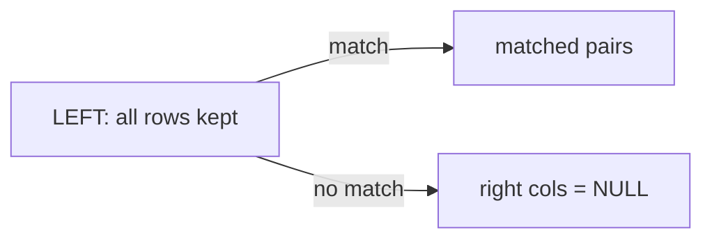

# Module 04 — JOINs: Combining Tables

> The single most important SQL skill. Real data is split across tables; JOINs put it back together. Interviews live here.

---

## 4.1 Why Tables Are Split (Normalization)

We don't store the department name in every employee row — we'd repeat it thousands of times. Instead, `employees` stores a `dept_id` that **points to** the `departments` table. JOINs follow those pointers.

```
employees                departments
emp_id dept_id           dept_id  dept_name
  1      1     ────────►    1      Engineering
  2      1                  2      Sales
  3      2     ────────►
```

## 4.2 INNER JOIN — Matching Rows from Both Tables

Returns rows where the join condition matches in **both** tables:
```sql
SELECT e.name, d.dept_name
FROM employees e
JOIN departments d ON e.dept_id = d.dept_id;
```
- `e` and `d` are **aliases** (shorthand for the tables).
- `ON e.dept_id = d.dept_id` is the **join condition** (which rows pair up).
- Plain `JOIN` = `INNER JOIN`.

> An employee with a `dept_id` that has no match in `departments` is **dropped** by an inner join.

## 4.3 LEFT JOIN — Keep All Left Rows

Keeps **every** row from the left table; unmatched right-side columns become `NULL`:
```sql
-- All departments, even those with no employees
SELECT d.dept_name, e.name
FROM departments d
LEFT JOIN employees e ON d.dept_id = e.dept_id;
```
Use `LEFT JOIN` when you must not lose rows from the main table.



## 4.4 The Join Types

| Join | Keeps |
|------|-------|
| `INNER JOIN` | only matching rows (both sides) |
| `LEFT JOIN` | all left rows + matches |
| `RIGHT JOIN` | all right rows + matches |
| `FULL OUTER JOIN` | all rows from both sides |
| `CROSS JOIN` | every combination (Cartesian product) |

`RIGHT JOIN` is just a `LEFT JOIN` written backwards — most people always use LEFT.

## 4.5 The Anti-Join — "Rows With No Match"

A super-common interview task: find rows in A with **no** match in B. Do a `LEFT JOIN` and keep the NULLs:
```sql
-- Customers who never placed an order
SELECT c.name
FROM customers c
LEFT JOIN orders o ON c.customer_id = o.customer_id
WHERE o.order_id IS NULL;      -- no matching order → NULL
```

## 4.6 Joining Three or More Tables

Chain joins — each `JOIN … ON` links one more table:
```sql
SELECT o.order_id, c.name AS customer, p.product_name, o.amount
FROM orders o
JOIN customers c ON o.customer_id = c.customer_id
JOIN products  p ON o.product_id  = p.product_id;
```

## 4.7 Self Join — a Table Joined to Itself

When rows relate to other rows in the *same* table (e.g., employee → manager):
```sql
SELECT e.name AS employee, m.name AS manager
FROM employees e
JOIN employees m ON e.manager_id = m.emp_id;   -- m = the manager row
```
Treat the two aliases (`e`, `m`) as if they were two separate tables.

## 4.8 JOIN + GROUP BY — the Everyday Combo

Most analytics = join tables, then aggregate:
```sql
-- Revenue per product category
SELECT p.category, SUM(o.amount) AS revenue
FROM orders o
JOIN products p ON o.product_id = p.product_id
GROUP BY p.category
ORDER BY revenue DESC;
```

## 4.9 Common JOIN Mistakes

- **Forgetting the ON clause** → accidental CROSS JOIN (every combination — huge, wrong results).
- **Wrong join type** → an INNER JOIN silently drops rows you needed (use LEFT).
- **Counting after a join** → `COUNT(*)` may double-count if one row matches many; use `COUNT(DISTINCT …)`.
- **Ambiguous columns** → if both tables have `dept_id`, qualify it: `e.dept_id`.

## 4.10 A Mental Model

Think of a JOIN as: "for each row on the left, find the matching row(s) on the right and stick their columns on." INNER drops non-matches; LEFT keeps them with NULLs.

---

## ✅ Key Takeaways
1. Tables are split to avoid repetition; **JOINs recombine them** via key columns.
2. `INNER JOIN` keeps only matches; `LEFT JOIN` keeps all left rows (+NULLs for non-matches).
3. **Anti-join** = `LEFT JOIN … WHERE right.key IS NULL` → "rows with no match".
4. Chain joins for 3+ tables; use a **self join** for within-table relationships (employee↔manager).
5. **JOIN + GROUP BY** powers most analytics.
6. Qualify columns (`e.dept_id`), pick the right join type, and beware double-counting.

## 🏋️ Exercises
1. List each employee with their department name (INNER JOIN).
2. List all departments and their employees, including empty departments (LEFT JOIN).
3. Find customers who never placed an order (anti-join).
4. Show each order with the customer name and product name (3-table join).
5. Show each employee alongside their manager's name (self join).
6. Compute total revenue per product category (join + group by).

**Next:** [Module 05 — Subqueries & CTEs →](module-05-subqueries-ctes.md)

---

*🗄️ SQL Mastery — [PJ's Academy](https://pjsacademy.com)*
